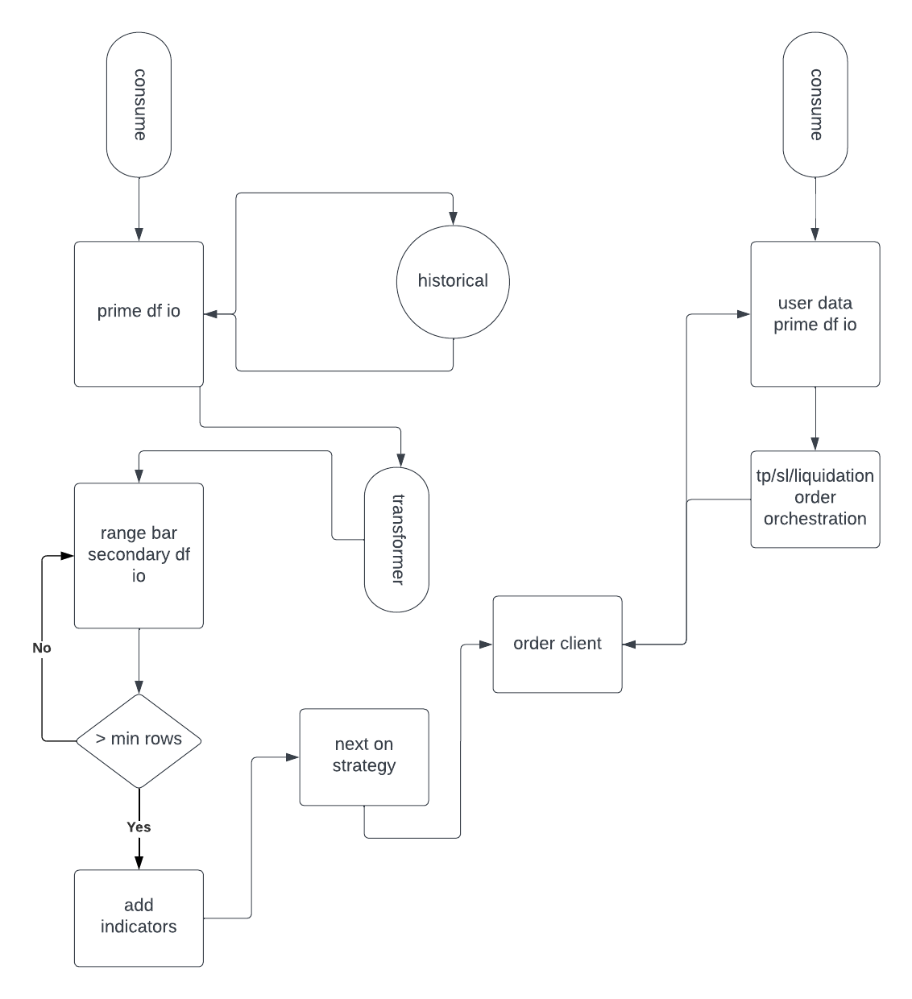

https://binance-docs.github.io/apidocs/futures/en/

## Architecture v2

## To Do
* offline protection for account admin - if failed orchestration retry until successful
* somehow transformers are being instantiated, even in tests which exclude those objects (was because there was an inst somewhere now removed, but retest) 
* can figure out what is missing from requirements.txt by changing the folder name, this seems to disconnect libraries from the project somehow, weird
* issue with a loop where historical is called multiple times due to src/stream_consumers/transformers/range_bars.py#L45
* append buy, sell lines of df to csv 
