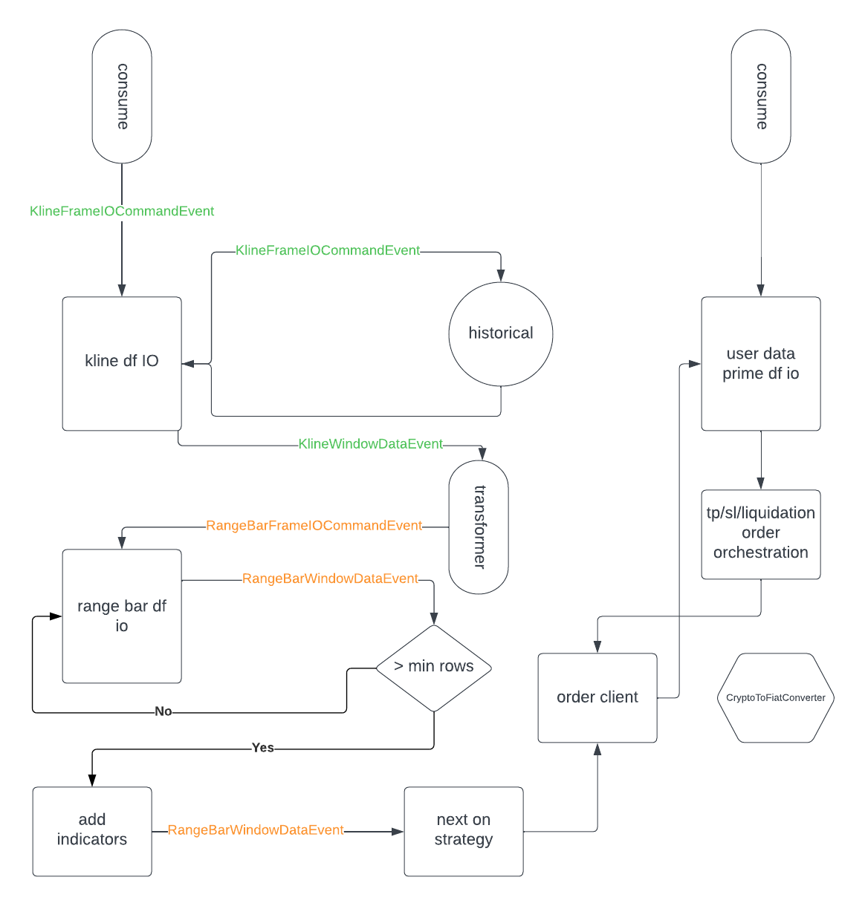

https://binance-docs.github.io/apidocs/futures/en/

## Architecture v2

## To Do
* offline protection for account admin - if failed orchestration retry until successful
* append buy, sell lines of df to csv 
* bug: adv is missing 
Exception has occurred: KeyError
'adv'
KeyError: 'adv'

The above exception was the direct cause of the following exception:

  File "/home/just/kc/rig/src/stream_consumers/secondary_transformers/range_bars.py", line 58, in create_range_bar_df
    current_bar = {'adv': df.iloc[0]['adv'], 'volume': df.iloc[0]['volume'], 'average_adr': df.iloc[0]['average_adr'], 'timestamp': df.index.to_series(
                          ~~~~~~~~~~^^^^^^^
  File "/home/just/kc/rig/src/stream_consumers/secondary_transformers/range_bars.py", line 41, in process
    range_bar_df = self.create_range_bar_df(e.df)
* remember to build in counter intelligence to stop other systems from observing the strategy pattern as mentioned in book 'Lean Algo Trading, Sebastien Danadio chap 1 pg 25'

## Notes
* [lucid chart](https://lucid.app/lucidchart/73458ddb-e0f2-4dde-9e6e-c1772800c46e/edit?viewport_loc=28%2C-860%2C1707%2C811%2C0_0&invitationId=inv_4758b35a-2015-4977-bb89-6a140faee88e)
* python version 3.11
* python.analysis.typeCheckingMode basic - strict was painful
* pip install -r requirements.txt
* some patterns, techniques & adapted modules were extracted from https://github.com/freqtrade/freqtrade
* use to bypass seemly unsolvable typing issues: # type: ignore

