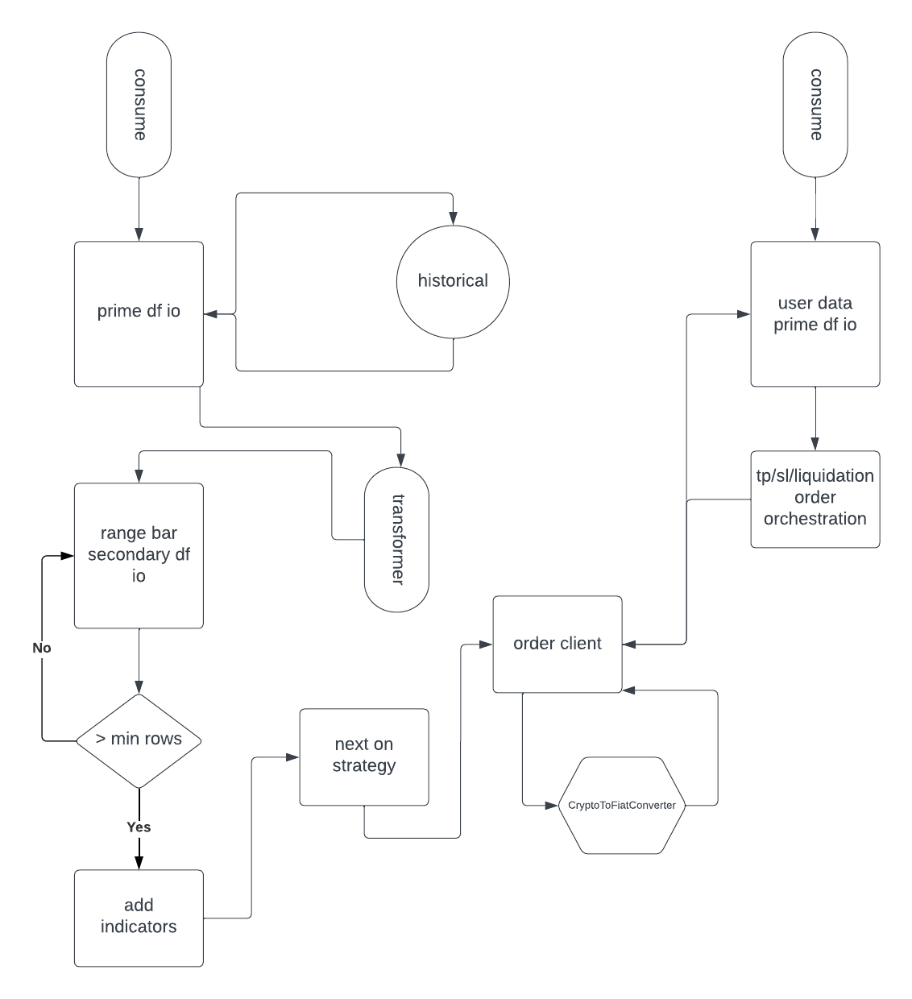

https://binance-docs.github.io/apidocs/futures/en/

## Architecture v2

## To Do
* offline protection for account admin - if failed orchestration retry until successful
* append buy, sell lines of df to csv 

## Notes
* [lucid chart](https://lucid.app/lucidchart/73458ddb-e0f2-4dde-9e6e-c1772800c46e/edit?viewport_loc=28%2C-860%2C1707%2C811%2C0_0&invitationId=inv_4758b35a-2015-4977-bb89-6a140faee88e)
* python version 3.11
* python.analysis.typeCheckingMode basic - strict was painful
* pip install -r requirements.txt
* some patterns, techniques & adapted modules were extracted from https://github.com/freqtrade/freqtrade
* use to bypass seemly unsolvable typing issues: # type: ignore

